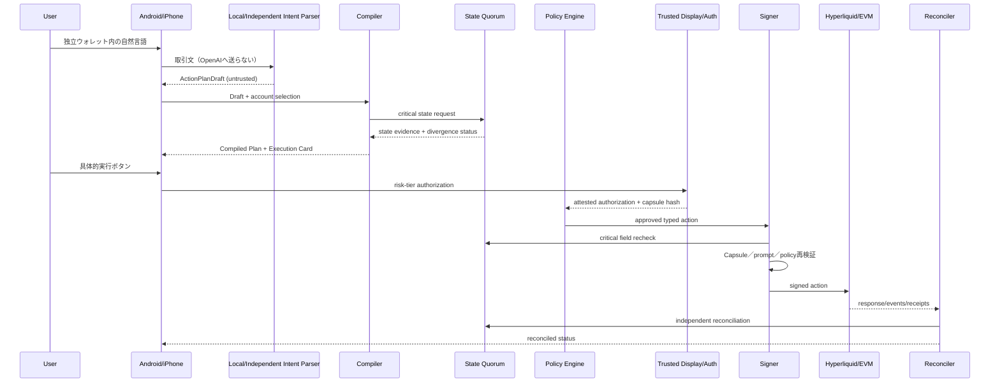

# システムアーキテクチャ

## コンポーネント

### Android native shell

- Compose UI
- Conversation state
- Execution Card renderer
- manual order／emergency UI
- Address Book
- local policy cache
- Keystore auth key
- Protected Confirmation capability client
- device attestation client
- device-local Trade Agent signer候補
- root wallet adapter／threshold client
- encrypted local event queue

### iOS native shell

- SwiftUI UI／navigation
- Conversation state／Execution Card renderer
- manual order／emergency UI
- Address Book／local policy cache
- Secure Enclave P-256 Authorization Key
- Keychain ThisDeviceOnly／non-synchronizable storage
- LocalAuthentication
- DeviceCheck App Attest client
- external wallet／Universal Link adapter
- Threshold ECDSA client候補
- encrypted local event queue
- scene capture／background privacy controller

### Backend control plane

- API Gateway
- Authentication／Device registry
- Transaction Intent Parser
  - 端末内の決定論処理を第一候補
  - 必要時もOpenAIから分離された独立運用の非OpenAIコンポーネントだけを候補にする
  - 出力は常にuntrusted draft
  - Signer、broadcast、feature gateへ到達不可
- Non-transactional Support Gateway（任意）
  - provider credentialはbackend secret managerのみ
  - mobileからOpenAIへの直接通信を禁止
  - 固定用語ID、固定安全トピック、固定エラーコード、不透明なread-only reference IDだけを受理
  - user／device auth、nonce、replay防止、rate／cost budget
  - server-side model／schema／retention enforcement
  - 取引文、宛先、金額、asset／network、quote、payloadを受理しない
- Deterministic Compiler
- State Evidence／Quorum Service
- Metadata／Contract Registry
- Policy Engine
- Execution Capsule Service
- Saga Orchestrator
- Hyperliquid／Bridge／Vault Adapter
- Reconciliation workers
- Audit Event Store
- Feature Gate Service
- Alerting

### Independent read plane

- official API
- independent API／indexer
- self-run non-validating node where required
- Arbitrum／HyperEVM RPC quorum
- contract bytecode／paused-state monitor

同一provider、同一cache、同一databaseを複数sourceと数えない。

### Signer plane

- Trade Signing Module: device-localを標準候補。server／threshold方式は別監査・法務ゲート
- Root Wallet Adapter／Threshold Signer
- Recovery process
- HSM／confidential compute／threshold provider as selected
- no inbound public internet
- strict mTLS
- signed policy bundle
- independent audit log

## データフロー



## ネットワーク境界

- Transaction Intent ParserはSignerに到達不可
- 取引Intent ParserはOpenAI endpointへegress不可
- Android／iOSはOpenAI provider endpointへ直接到達せず、任意の非取引サポートだけをfirst-party Support Gateway経由にする
- AI provider credentialはmobile artifact／remote config／client telemetryへ配布しない
- SignerはOpenAIへ到達不可
- LLMはstate sourceを選択不可
- CompilerとSignerはcritical stateを別経路で照合
- arbitrary URL fetcherは実行系VPCから分離
- production DBから秘密鍵を取得できない
- observability collectorはpayload redaction必須
- admin操作は別identity plane
- source divergence時はwrite fail closed

## デプロイ単位

1. `mobile-app`
2. `control-api`
3. `transaction-intent-service`（local／independent non-OpenAI）
4. `non-transactional-support-service`（任意）
5. `compiler-service`
6. `state-evidence-service`
7. `policy-service`
8. `execution-orchestrator`
9. `hyperliquid-read-service`
10. `trade-signing-module`
11. `root-wallet-adapter-or-signer`
12. `reconciler`
13. `registry-monitor`
14. `audit-store`

小規模MVPではcontrol-planeの一部をまとめてもよい。AI、root signer、state quorumの独立境界は崩さない。

## Shared deterministic core

Android／iOS／backendで共有するのは、domain、compiler、policy、canonical hash、state machine、display modelである。OSのsecurity APIは共有抽象へ押し込まず、capabilityとassuranceを明示的に返す。推奨構成は`29_CROSS_PLATFORM_ARCHITECTURE.md`を参照する。

## 2026-07-29.1追加コンポーネント

```text
Standalone-wallet voice/text
  -> Local deterministic / independent non-OpenAI Intent Parser (untrusted draft only)
  -> Deterministic Compiler / Policy
  -> Preview services
       - Liquidation Preview
       - Fee Readiness
       - JPYC EX Handoff
  -> Authorization
  -> Control API
  -> Signer / Adapter / Reconciler

ChatGPT/OpenAI non-transactional support service
  -> Redacted Status / Fixed Glossary / Fixed Error / Generic Safety / Neutral Handoff
  -X-> Transaction Intent / Manual Steps / Control API writes / Signer / Broadcast
```

`Fee Readiness`は残高、必要手数料、目標reserve、route／sponsor、月間上限を評価する。`JPYC EX Handoff`は最終申込みを確定せず、状態連携と入金検証を行う。`Manual Guidance Catalog`は独立ウォレット内だけで使用し、AI生成ではなくversioned・署名済みデータとして各アプリ版のボタン名へ束縛する。ChatGPT／OpenAI-facing contractから参照できない。
